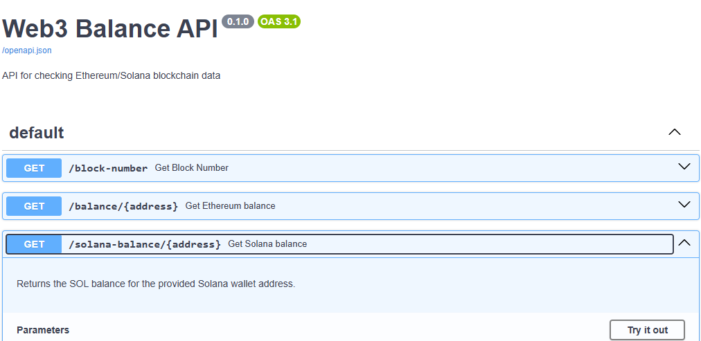

# python-web3-app

Work in progress: Vibe coding a Python web3 app that connects to the Ethereum Sepolia testnet using `web3.py` to query the ETH balance of a user-provided address via the CLI. This project demonstrates basic Python programming, blockchain interaction, and API development/documentation with FastAPI. 

## Context

This is a learning exercise where I used AI to help guide me through the process of developing a web3 app that queries the blockchain. As someone actively learning Python, this was extremely helpful and conducive to learning. To that end, I made sure to add comments on every line to document what the code does.

## Features

- Connects to the Sepolia testnet via a QuickNode endpoint.
- Prompts users to input an Ethereum address and validates it using `web3.py`'s checksum address conversion.
- Queries and displays the ETH balance of the provided address.
- Includes a FastAPI back-end with endpoints documented.
- Uses Coinbase Wallet for testing with Sepolia test ETH.
- Implements error handling for invalid addresses and connection issues.

## Tech stack

- Python 3: The core programming language.
- `web3.py` (`v7.12.0`): Python library for Ethereum blockchain interaction.
- `python-dotenv`: Loads environment variables (e.g., QuickNode API URL) from a `.env` file.
- [FastAPI](https://fastapi.tiangolo.com/): Provides a framework for automated API documentaton for all endpoints.
- [Coinbase Wallet](https://www.coinbase.com/wallet): Non-custodial wallet for managing Sepolia testnet addresses and test ETH.
- [QuickNode](https://www.quicknode.com/): Provides the Sepolia testnet endpoint for blockchain access.
- [Render](https://render.com/): Hosting platform for deploying the FastAPI backend for public API access.

## Prerequisites

- Python 3.6+ installed.
- A Coinbase Wallet set to the Sepolia testnet.
- Test ETH in your Coinbase Wallet’s Sepolia address obtained from a faucet (like PoW Faucet).
  - If you don't have a test wallet loaded with test ETH, any valid Ethereum address will work.
- A QuickNode account with a Sepolia endpoint URL.

## Installation

1. Clone the repo:

    ```bash
    git clone https://github.com/nicoalba/python-web3-app.git
    cd python-web3-app
    ```

2. Set up a virtual environment:

    ```bash
    python -m venv venv
    source venv/bin/activate  # On Windows: venv\Scripts\activate
    ```

3. Install dependencies:

    ```bash
    pip install web3 python-dotenv fastapi uvicorn
    ```

4. Configure the environment variables:

    1. Create a `.env` file in the project root.
    2. Add your QuickNode Sepolia endpoint URL:

        ```bash
        WEB3_PROVIDER_URL=https://your-quicknode-sepolia-url
        ```
    
       You can get your URL by signing up at QuickNode and creating a Sepolia endpoint.

5. Set up Coinbase Wallet:

    1. Install the [Coinbase Wallet browser extension](coinbase.com/wallet).
    2. Switch to the Sepolia testnet in the wallet.
    3. Fund your Sepolia address with test ETH from the [QuickNode Ethereum Faucet](https://faucet.quicknode.com/ethereum).

## Usage via the CLI

1. Run the script:

    ```bash
    python eth-web3-app.py.py
    ```

2. Follow the prompt and enter a valid Ethereum address.

    The script will:

    1. Load the QuickNode endpoint from the `.env` file.
    2. Connect to the Sepolia testnet and display the latest block number.
    4. Validate the address and display the ETH balance.

## Example output

```plain
Looking for .env file at: /path/to/python-web3-app/.env
web3.py version: 7.12.0
WEB3_PROVIDER_URL: https://omniscient-distinguished-sailboat...
Connected to blockchain!
Latest block number: 8693694
Enter an Ethereum address to check balance: 0xYourAddress
ETH balance of 0xYourAddress: 0.1 ETH
```

## Usage (API)

1. Run the FastAPI server:

    ```bash
    uvicorn eth-web3-app:app --reload
    ```

2. Go to <http://localhost:8000/docs> in a browser to view interactive API documentation:

   

## Live demo

The FastAPI backend is deployed on Render for public access. Go to <https://python-web3-app.onrender.com/docs> to explore the interactive API documentation and test the endpoints:

- `GET /block-number`: Get the latest Sepolia testnet block number.
- `GET /balance/{address}`: Query the ETH balance of a valid Ethereum address.

To test the API using curl:

```bash
curl https://python-web3-app.onrender.com/block-number
curl https://python-web3-app.onrender.com/balance/0xYourValidAddress
```

**Note**: The free-tier Render instance spins down after 15 minutes of inactivity, causing a 30-sec delay on the next request.

## Future enhancements

- Add ERC-20 token balance queries for Sepolia test tokens.
- Deploy the FastAPI backend to a platform like Render or Vercel for public access.
- Configure with CORS for cross-origin requests.
